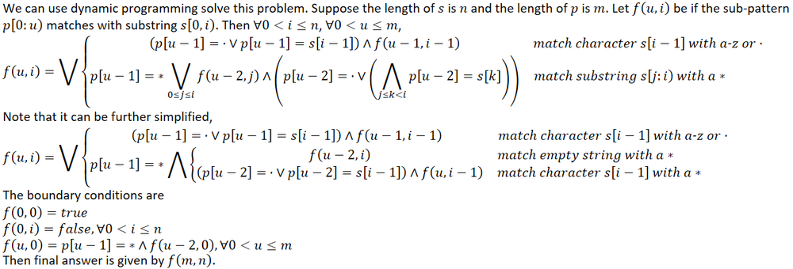

# Leetcode OJ

* TODO: 
  * 理解第四题的log(M+N)算法

### 1. Two Sum

* easy

### 2. Add Two Numbers

* 两数相加，两数用链表形式表示

### 3. Longest Substring Without Repeating Characters

* 滑动窗口`[i, j]`
* 每次向右滑动`j`，当遇到之前重复出现的字符`c`时，此时`[i, j-1]`区间没有重复的，`i`定位到`max(i, 上一个c的位置+1)`，此时`[i, j]`之间消除了重复字符c

* `O(N)`

### 4. Median of Two Sorted Arrays

* O(m+n)
* 类似于归并排序，对奇偶有不同的要求

### 5. Longest Palindromic Substring

- 给出一个字符串s，求s的最长回文字串的长度
- `dp[i][j]`表示s[i]到s[j]所表示的字串是否是回文字串。只有0和1
- 递推方程：
  - 当s[i] == s[j] : `dp[i][j] = dp[i+1][j-1]`
  - 当s[i] != s[j] : `dp[i][j] =0`
  - 边界`i == j || j = i+1`：`dp[i][j] = 1, dp[i][i+1] = (s[i] == s[i+1]) ? 1 : 0`

```c++
for(int i = len - 1; i >= 0; --i) {
    for(int j = i; j < len; ++j) {
        if(s[i] == s[j] && (j - i < 3 || dp[i+1][j-1])) {
```

* 上述判断可以解决边界的判断

### 8. String to Integer (atoi)

* find_if、find_if_not搭配匿名函数很方便的

### 10. Regular Expression Matching

* using C++11 \<regex> 

```c++
regex r(p);
return regex_match(s, r);
```

* dp

